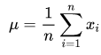
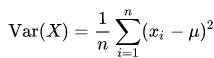

# Exam-1: Adding additional functions to linked lists

In this exam you will be adding 4 functions to existing code. This existing code is from the `DoubleLinkedList` folder from homework 1. ***This is an individual assignment, do not work with any other students. Failure to abide by this will result in a zero on the exam.*** The are the 4 functions that you will add are:
    
    linked_mean
    linked_variance
    linked_size
    linked_min

Let's talk about each function.

## linked_mean

This function will sum all values in a linked list and then divide by the size of the linked list. You have two options when getting the size of the linked list: you can either count as you iterate through the linked list, or you can use `linked_size` to get the size of the linked list to get the mean. Here is what the `function prototype should look like`:
```cpp
    float linked_mean(DoubleLinkedList *root_node);
```
This is the mathematical equation for mean:



## linked_variance
This function will calculate the variance of a linked list. This is a bit more complicated than mean, but it can be done. First it is recommended to take the mean (mu) the loop through the entire linked list. While loop through the entire linked list, first take the difference between the current linked list node and the mean, then squaring that differnce, then add it to a accumulator (like a sum). After looping through the linked list, divide the accumulator with the size of the linked list.
```c
    float linked_variance(DoubleLinkedList *root_node);
```
This is the mathematical equation for variance:



## linked_size

The function `linked_size` will determine how long a given linked list is. You can loop through the entire linked list and create a counter to count how many times you loop through the linked list then return that counter as an output. Below is the function prototype.

Below is the function prototype:
```cpp
int linked_size(DoubleLinkedList *root_node, int a);
```
## linked_min

This function will iterate though the entire linked list and find the minimum value of the linked list. I recommend that you take the first item of the linked list and make an 'initial minimum' then compare with the rest of the linked list. At the end of the function you must return the minimum value. Here is the function prototype.
```cpp
int linked_min(DoubleLinkedList *root_node);
```
## linked_max example

To get you all started, here is an example function in which the function will find the maximum value of a linked list. It will create an 'initial maximum' then `iterate though the entire linked list`, and check if the current value that we are evaluating is greater than the current maximum. If the current value is greater than the current maximum, the current maximum becomes the current value. Here is that function.

```cpp
int linked_max(DoubleLinkedList *root_node) {
    DoubleLinkedList *temp = root_node;
    int temp_max = temp->value;
    for (temp = root_node->next; temp != NULL; temp = temp->next) {
        if (temp->value > temp_max) {
            temp_max = temp->value;
        }
    }
}
```

## Source code

You should not have to edit `double_linked_list.h`. You can edit `main.c`, but it is not necessary. I recommend editing `main.c` by commenting out code to see which functions work or debug functions if you are having trouble.  `You will have to edit dll_functions.c`. A Makefile will be provided to make compiling easier. `To download the exam to your computer please accept it on UNM Learn`. `To submit your exam, please push to your git, and do not upload your code to your personal github`. You will then have to type:

    git clone https://github.com/UNMECE231Sp2021/<your github username>
    
to download your exam.

## Desired output

The output below is the result of implementing the functions correctly:

```
First linked list:
4 2 5 8 3
Second linked list:
3 8 6 4 7

Mean of first linked list: 4.40
Mean of second linked list: 5.60
Variance of first linked list: 4.24
Variance of second linked list: 3.44

Minimum values for linked lists a and b:
a_min: 2.000000, b_min: 3.000000
a_size: 5, b_size: 7

Third linked list:
-4 9 5 -1 8 -7 12 -2 

Mean of third linked list: 2.50
Variance of third linked list: 41.75
Minimum values for the third linked lists: -7
Size of third linked list: 8
```

# Rubric

|Requirement          |Score  |
| :---:               | :---: |
|linked_mean          |25     |
|linked_variance      |25     |
|linked_size          |20     |
|linked_min           |20     |
|Readable, clean code |10     |
|Total                |100    |
